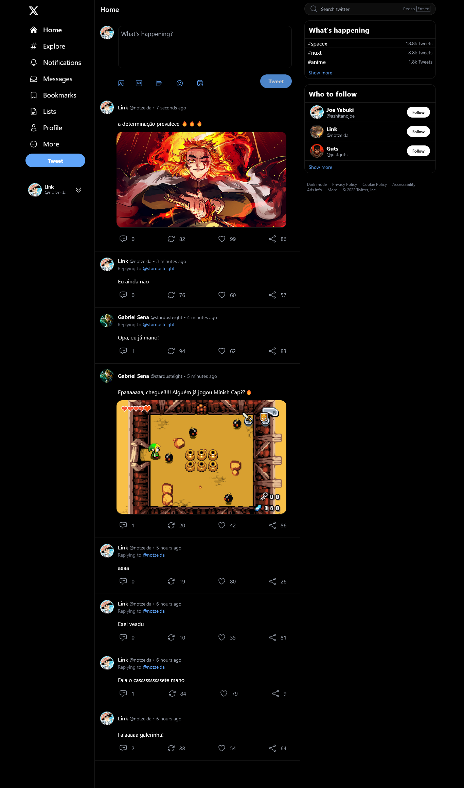

<div align="center">
  
</div>

<h1 align="center">
   Twitter, Make Tweets
</h1>

This project is a web application developed with the aim of improving knowledge in specific frontend and backend technologies. The application aims to replicate the interface of two main Twitter pages: the posts feed and the login page.

Vue.js is a progressive JavaScript framework that allows the creation of reactive and interactive user interfaces broken down into reusable components. Nuxt 3 is an updated version of Nuxt.js, a Vue.js framework focused on creating SSR (Server-Side Rendered) and SSG (Static Site Generated) applications, offering better performance and an improved development experience.

To share logic between components, the project uses Composables, which are part of the Vue.js Composition API, allowing you to reuse logic across multiple components, making the code more modular and easier to maintain. The project's styling and styling is done with the help of TailwindCSS, a utility CSS framework that makes it easy to create custom styles through utility classes.

To handle communication between components, the application uses the Mitt library, which is a functional event emitter, offering a functional approach to event communication.

API routes are created using the Nuxt.js API Routes functionality, allowing communication between the frontend and the backend. The Transformers pattern is used to transform data before being sent to the client, allowing formatting and filtering of information before displaying it in the interface.

For interaction with the NO SQL database, the project uses the Prisma tool, which facilitates the creation of database schemas through declarative language and allows queries to be carried out in a more intuitive way.

For form data analysis, especially file uploads, the project uses the Formidable library, simplifying the processing of data sent by forms.

The Cloudinary service is used to host images and manage digital assets, storing and delivering images to the application.

For authentication and authorization in the web application, the project uses Json Web Tokens, allowing the creation of signed tokens to authenticate users. In addition, the access and refresh token security approach is adopted, where users are given an access token with a short expiration and can renew it through the use of a refresh token.

In short, the project is a combination of modern frontend and backend technologies, which aims to replicate aspects of Twitter's interface and functionality, demonstrating the efficient and safe use of technologies such as TypeScript, Vue.js, Nuxt.js, TailwindCSS, Prisma and Json Web Tokens.

## :hammer_and_wrench: Tools

### Frontend

* TypeScript
* Vue.js
* Nuxt 3
* Composables
* TailwindCSS
* Mitt Library (functional event emitter)

### Backend

* Nuxt Server Engine - Nitro Server
* TypeScript
* API Routes
* Transformers Pattern
* Prisma
* Formidable Library (for parsing form data, especially file uploads)
* Cloudinary
* Json Web Tokens
* Access and Refresh tokens authentication strategy 

## :mailbox_with_mail: Utilities
 
### <strong>Composables Vs. Hooks</strong>

Composables in Vue.js can be compared to Hooks in React in terms of purpose and functionality. Both features aim to facilitate the reuse of logic in components, improving code composition and modularity.

While the implementations differ between Vue.js and React, both Composables and Hooks provide a way to extract logic from individual components into reusable functions.

Composables are an important part of the Vue.js Composition API, introduced in version 3 of the framework. They allow you to reuse logic and functionality in different components, making the code more modular, readable and maintainable.

The Composition API is a new way of defining logic in a Vue.js component that offers greater flexibility and organization compared to the Options API-based approach used in previous versions of Vue.js.

`Composables are functions that encapsulate the logic of a component and can be used anywhere in the component or even in other components`. The idea behind Composables is to separate component logic from its template structure, allowing different components to share the same logic easily and without code duplication.

Here are some key concepts about Composables and their importance:

1. Logic reuse: By creating Composables, you can isolate and reuse specific blocks of logic across multiple components. This leads to cleaner, more organized code and easier maintenance since changes to logic only need to be made in one place.

2. Separation of concerns: By using Composables, you separate the component logic from your template structure. This helps maintain clarity and makes the components easier to understand, as each piece of code has a clear responsibility.

3. Modularity: The Composables approach allows you to divide the component's logic into small parts, each responsible for a specific task. This makes it easy to organize and assemble these parts to create more complex components.

4. Ease of Testing: By having isolated logics in Composables, it is easier to write unit tests for these functions, as they can be tested independently of the components.

5. Less Coupling: Composables help reduce coupling between components, making the application more flexible and allowing parts of the code to be changed without affecting other parts.

Example of a Composable:

```javascript
// useCounter.js (exemplo de um Composable)
import { ref } from 'vue';

export function useCounter(initialValue) {
  const count = ref(initialValue);

  function increment() {
    count.value++;
  }

  function decrement() {
    count.value--;
  }

  return {
    count,
    increment,
    decrement,
  };
}
```

In this example, we create a Composable called `useCounter`, which encapsulates the counting logic. It has an internal state called `count`, as well as `increment` and `decrement` functions to manipulate that state.

By using this Composable in a Vue.js component, you can easily reuse the counting functionality without having to rewrite the logic. This simplifies the component's code and makes development more efficient.

In short, Composables are a powerful abstraction that makes Vue.js development more modular, reusable, and organized. They play a key role in the Composition API and are highly recommended for Vue.js projects, especially in scenarios where logic reuse is required.


### <strong>Transformers Pattern</strong>

The Transformers Pattern is a design pattern that aims to transform data before it is sent to the client or after it is received from the server. This transformation can include formatting, filtering, mapping and any other manipulation of the data to adapt it to the format desired by the application.

The Transformers pattern is commonly used in applications that consume APIs or external services, where incoming data may come in a different format than what is best suited for display in the UI. It allows separating data transformation logic from presentation logic, ensuring better code organization and making maintenance easier.

The Transformers pattern can be applied to both the frontend and the backend, depending on the specific needs of the project.

- Frontend:

On the frontend, Transformers are often used in conjunction with API calls to format incoming data before being used in the frontend. This can include normalizing data, converting formats, handling null or undefined values, and other manipulations.

For example, consider a scenario where the API returns a user's data in a specific format, and you want to map that data to a more suitable format for use in a Vue.js component. In this case, you can create a Transformer function that takes the raw data from the API as input and returns the formatted data as needed by the component.

- Backend:

On the backend, Transformers can be used to format the data before sending it to the client in response to a request. This transformation can be useful to ensure that data is delivered in accordance with the API contract or in a standardized format for all responses.

For example, if you are building an API that returns data from a database using an ORM (Object-Relational Mapping) such as Prisma, the data from the database can be mapped to a specific format using a Transformer before being sent to the client.

The overall goal of the Transformers Pattern is to encapsulate data transformation logic in reusable functions or classes, making the code more modular and flexible. This allows you to easily change the way data is handled without affecting the application's presentation logic or business logic.

In summary, the Transformers Pattern is an approach to transforming data before it is used in the application, either on the frontend or the backend. It helps separate concerns around data formatting and manipulation, improving code organization and transformation logic reuse.


### <strong>Access and Refresh tokens authentication strategy</strong>

The authentication strategy with Access and Refresh tokens is a common approach used to authenticate users in web and mobile applications. This strategy aims to ensure security and the best user experience by allowing tokens to be renewed without the need to log in again.

Here is a detailed explanation of the authentication strategy with Access and Refresh tokens:

1. Access Token:
   - The Access Token is a short-lived token that is issued by the authentication server (usually using JWT - JSON Web Tokens) after the user has successfully logged in.
   - This token contains authenticated user information such as user identification (ID), permissions and other relevant details.
   - The Access Token is used to authorize requests made by the client (frontend) to the server (backend). The client must include the Access Token in each request to access protected resources on the server.
   - The Access Token has a short validity, usually from a few minutes to hours. This short validity increases security, since, if the token is compromised, its use will be limited in time.

2. Refresh Token:
   - The Refresh Token is a long-lived token that is issued along with the Access Token upon successful login.
   - The main function of the Refresh Token is to allow the customer to renew the Access Token without the need to login again. This improves the user experience, as it avoids the user having to provide his credentials with each token renewal.
   - The Refresh Token is not sent in each request to the server. It is stored securely on the client (usually in a secure cookie or local storage), and is only used when the Access Token expires.
   - When the Access Token expires, the client makes a request to the server to renew the token. The server verifies that the Refresh Token is valid and, if so, issues a new Access Token, allowing the client to continue accessing protected resources.

3. Authentication flow:
   - The authentication flow using Access and Refresh tokens usually follows these steps:
      1. The client makes a login request to the server, providing its credentials (such as username and password).
      2. The server checks the credentials and, if correct, issues an Access Token and Refresh Token in response.
      3. The client stores the Refresh Token securely and uses the Access Token to access protected resources on the server.
      4. When the Access Token expires (usually defined in an "exp" header on the token), the client uses the Refresh Token to request a new Access Token.
      5. The server checks if the Refresh Token is valid and, if so, issues a new Access Token to the client.
      6. The client repeats the process of using the new Access Token to access protected resources.
      7. This flow repeats as long as the Refresh Token remains valid and as long as the user is logged in.

This authentication strategy is widely adopted as it is a secure and convenient approach to user authentication in web and mobile applications. It allows continuous renewal of tokens, keeping the user authenticated and protecting application resources against unauthorized access.



<p align="center">Project made with :blue_heart: by <a href="https://github.com/stardusteight-d4c">Gabriel Sena</a></p>
