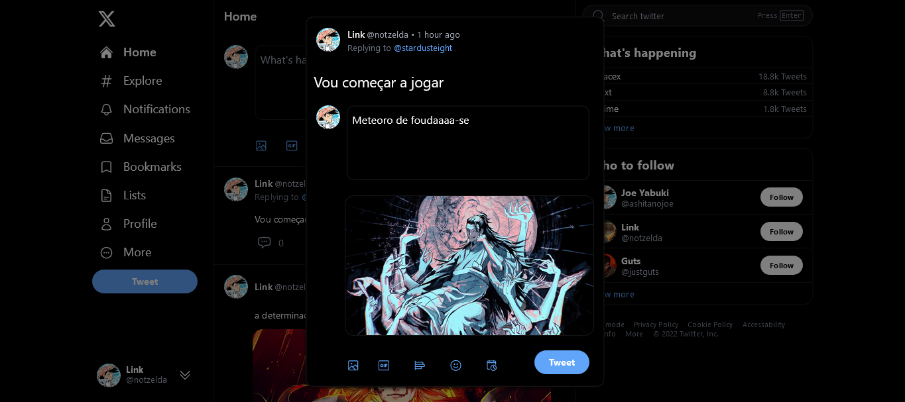

<div align="center">
  
</div>

<h1 align="center">
   Twitter, Twitter Feed
</h1>

This project is a web application developed with the aim of improving knowledge in specific frontend and backend technologies. The application aims to replicate the interface of two main Twitter pages: the posts feed and the login page.

Vue.js is a progressive JavaScript framework that allows the creation of reactive and interactive user interfaces broken down into reusable components. Nuxt 3 is an updated version of Nuxt.js, a Vue.js framework focused on creating SSR (Server-Side Rendered) and SSG (Static Site Generated) applications, offering better performance and an improved development experience.

To share logic between components, the project uses Composables, which are part of the Vue.js Composition API, allowing you to reuse logic across multiple components, making the code more modular and easier to maintain. The project's styling and styling is done with the help of TailwindCSS, a utility CSS framework that makes it easy to create custom styles through utility classes.

To handle communication between components, the application uses the Mitt library, which is a functional event emitter, offering a functional approach to event communication.

API routes are created using the Nuxt.js API Routes functionality, allowing communication between the frontend and the backend. The Transformers pattern is used to transform data before being sent to the client, allowing formatting and filtering of information before displaying it in the interface.

For interaction with the SQL database, the project uses the Prisma tool, which facilitates the creation of database schemas through declarative language and allows queries to be carried out in a more intuitive way.

For form data analysis, especially file uploads, the project uses the Formidable library, simplifying the processing of data sent by forms.

The Cloudinary service is used to host images and manage digital assets, storing and delivering images to the application.

For authentication and authorization in the web application, the project uses Json Web Tokens, allowing the creation of signed tokens to authenticate users. In addition, the access and refresh token security approach is adopted, where users are given an access token with a short expiration and can renew it through the use of a refresh token.

In short, the project is a combination of modern frontend and backend technologies, which aims to replicate aspects of Twitter's interface and functionality, demonstrating the efficient and safe use of technologies such as TypeScript, Vue.js, Nuxt.js, TailwindCSS, Prisma and Json Web Tokens.

## :hammer_and_wrench: Tools

### Frontend

* TypeScript
* Vue.js
* Nuxt 3
* Composables
* TailwindCSS
* Mitt Library (functional event emitter)

### Backend

* Nuxt Server Engine - Nitro Server
* TypeScript
* API Routes
* Transformers Pattern
* Prisma
* Formidable Library (for parsing form data, especially file uploads)
* Cloudinary
* Json Web Tokens
* Access/Refresh tokens

## :mailbox_with_mail: Utilities
 
### <strong>Clean Architecture</strong>
 
Clean Architecture is a software architecture pattern that proposes a source code structure in layers, with the objective of separating responsibilities and making the software more testable, scalable and easy to maintain.

The core idea of Clean Architecture is that the business rules (core) of the software must be independent of any external technology (such as frameworks, databases, user interfaces, etc.), to ensure their integrity and reuse in different contexts.

For this, the architecture proposes the definition of well-defined layers, which are:

1. <strong>Entity Layer (Domain)</strong>: represents the domain entities, that is, the system's business rules;
2. <strong>Layer of Use Cases (Application)</strong>: implements the use cases of the system, which are specific actions of the software that manipulate the entities of the domain;
3. <strong>Infrastructure Layer</strong>: This is responsible for handling communication with the outside world, such as databases, file systems, networks, etc.

In addition, the architecture proposes the use of SOLID and DDD (Domain Driven Design) principles to ensure that the code is cohesive, properly coupled and easy to maintain.

Clean Architecture is a concept that can be applied in different programming languages ​​and frameworks, and is widely used in software projects that require high quality, scalability and maintenance.

### <strong>Domain-Driven Design</strong>
 
Domain-driven design (DDD) is a software development approach that places the business domain at the core of system modeling. It was proposed by Eric Evans in 2003 and aims to help create systems that are more flexible and adaptable to business changes.

DDD suggests creating a rich domain model that clearly reflects business rules and domain expert knowledge. This is done through collaboration between developers and domain experts so that the domain model is created together to ensure it reflects the needs of the business.

On the other hand, clean architecture is a software architecture approach that values the separation of responsibilities in well-defined layers, ensuring greater modularity, testability and code reuse. Clean architecture proposes that business rules should be the heart of the system and should be isolated from technical concerns such as infrastructure and framework.

Thus, there is a relationship between DDD and clean architecture, as both approaches emphasize the importance of business rules in software development. DDD emphasizes creating a rich domain model, while clean architecture proposes a modular architecture that prioritizes separation of responsibilities and technology independence.

In this way, clean architecture can be used as a framework for implementing DDD, as it provides a way to organize code to reflect the structure of the business domain. The clean architecture allows business rules to be implemented in a layer separate and independent of other technical layers, which helps ensure that the domain model is clear and maintainable.

### <strong>Hygraph and E-Commerce Security</strong>

The server through which the page is processed, as well as the customer acquire the product information through a common source, in this case I chose to use Hygraph which is a Headless CMS (Content Management System), which is a great option for manage the content of a website if you don't want to waste time implementing the entire interface, backend, as well as the database.

> *Process and acquire data entirely through the backend, rely as little as possible on information coming from the client side*
 
In common applications we are used to sending all the data that the backend needs to do the proper processing, as we already process this information on the client side to show the consumer the purchase/checkout information and the product itself, we could think of sending these information for the backend to process properly, however the client, the web page must behave only as an interface, an intermediary that sends the information of operations that the user wants to carry out. Otherwise sensitive information can be intercepted and even altered by the front-end, and thus the data that would arrive at the backend would no longer maintain an integrity, or a reliability factor.

So the solution to avoid manipulation of purchase data and avoid fraud was to make the customer send only the ID and Quantity of the product to the backend, that is, the backend now only depends on this information to process all the data purchase, acquiring the product data from a reliable source, from Hygraph itself, the application's Headless CMS.

```ts
// server/src/infra/http/graphql/queries.ts

import dotenv from "dotenv";

dotenv.config();

export const getProductById = async (ids: string[]) => {
  const products = await fetch(process.env.CMS_API_URL!, {
    method: "POST",
    headers: {
      "Content-Type": "application/json",
      Authorization: `Bearer ${process.env.HYGRAPH_API_ACCESS_TOKEN}`,
    },
    body: JSON.stringify({
      query: `
      query getProductById($ids: [ID]) {
        products(where: { id_in: $ids }) {
          id
          title
          stock
          img {
            url
          }
          price
        }
      }
      `,
      variables: {
        ids,
      },
    }),
  })
    .then((res) => res.json())
    .then((result) => result.data.products)
    .catch((error) => console.log(error));

  return products;
};
```

### <strong>Absolute Imports</strong>

Absolute Imports is a technique for importing modules into a project that allows you to reference the files from the root of the project directory, rather than using a path relative to the file being imported.

For example, instead of using import foo from '../../../components/foo' to import a component "foo" that is located in a directory 3 levels up, we can use import foo from '@/components /foo', where "@" is an alias representing the root of the project directory.

This makes imports simpler and less error-prone, as the absolute path doesn't change no matter where the source file is located. In addition, it also facilitates project refactoring as it is not necessary to manually update all imports of a given file when it is moved to a new folder.

Absolute Imports are common in larger projects and can be configured in different build tools and module systems such as Webpack and TypeScript.

```ts
// With Absolute Imports
import { useAppDispatch, useAppSelector } from '@/store/hooks'
import { openCart, selectCartTotalQuantity } from '@/store/slices/CartSlice'
import { selectCurrentConsumer } from '@/store/slices/ConsumerSlice'

// Without Absolute Imports
import { useAppDispatch, useAppSelector } from '../../../../store/hooks'
import { openCart, selectCartTotalQuantity } from '../../../../store/slices/CartSlice'
import { selectCurrentConsumer } from '../../../../store/slices/ConsumerSlice'
```

This application uses Vite + Typescript, so to add the desired absolute paths you need to add the paths property in the tsconfig.json file:

```json
{
  "compilerOptions": {
    "baseUrl": "./",
    "paths": {
      "@/*": ["src/*"],
      "@components/*": ["src/components/*"],
      "@store/*": ["src/store/*"],
      "@core/*": ["src/core/*"],
      "@assets/*": ["src/assets/*"]
    },
  },
  "include": ["src"],
  "references": [{ "path": "./tsconfig.node.json" }]
}
```

Vite, however, will not understand imports, so we can install a plugin called vite-tsconfig-paths to give vite the ability to resolve imports using TypeScript path mapping.

```ts
// web/vite.config.ts

import { defineConfig } from 'vite'
import react from '@vitejs/plugin-react-swc'
import tsconfigPaths from 'vite-tsconfig-paths'

// https://vitejs.dev/config/
export default defineConfig({
  plugins: [react(), tsconfigPaths()],
})
```



<p align="center">Project made with :blue_heart: by <a href="https://github.com/stardusteight-d4c">Gabriel Sena</a></p>


### @nuxtjs/tailwindcss resolve problemas de renderização dinamica com TailwindCSS entre outros

Acessando mongodb no container docker
```bash
docker compose up
docker compose exec mongodb bash
mongo -u admin -p password --authenticationDatabase admin
use db
show collections
db.nome_da_colecao.find()
```
